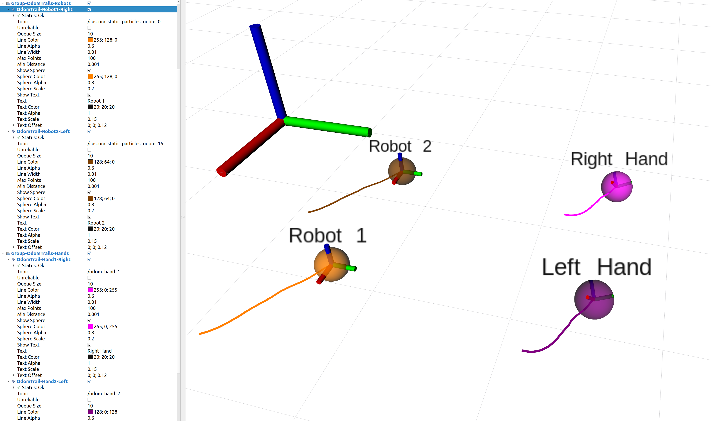

# rviz_odom_trail_plugin

An **RViz Display Plugin** that visualizes robot odometry as a trail (line strip) in 3D space, optionally with a sphere marking the last position and a text label. The plugin subscribes to a `nav_msgs/Odometry` topic and dynamically updates RViz with the latest pose data.

<p align="center">
  
</p>

## Features

- **Trail/Line** visualization (with configurable color, alpha, width, maximum number of points, etc.).
- **Sphere** at the latest odometry position (configurable color, alpha, and diameter).
- **3D Text** label at the latest position (optional; customizable text, color, size, and offset).

## Usage

### 1. Clone and Build

```bash
cd ~/catkin_ws/src
git clone https://github.com/YourUsername/rviz_odom_trail_plugin.git
cd ~/catkin_ws
catkin_make
source devel/setup.bash
Make sure you have all dependencies installed (e.g., rviz, roscpp, nav_msgs, etc.).
```

### 2. Start RViz and Add the Plugin

Start RViz:

```bash
rosrun rviz rviz
```

Click "Add" in the lower-left corner of RViz.  
Search for OdomTrail (or look under "By package" → rviz_odom_trail_plugin).  
Select OdomTrail and click OK.